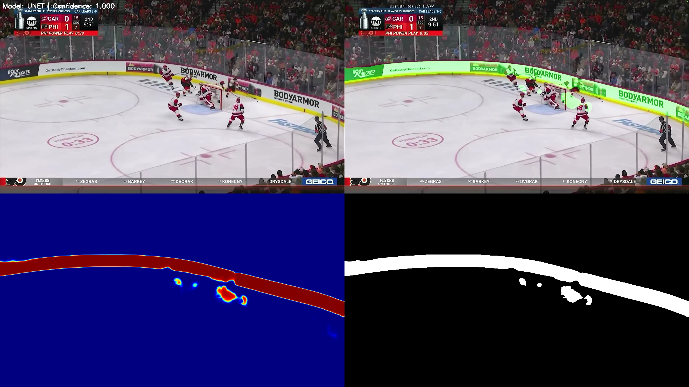
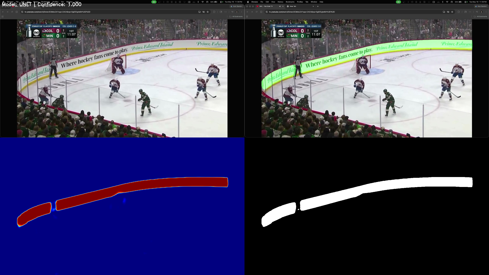
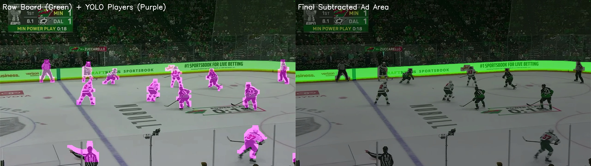
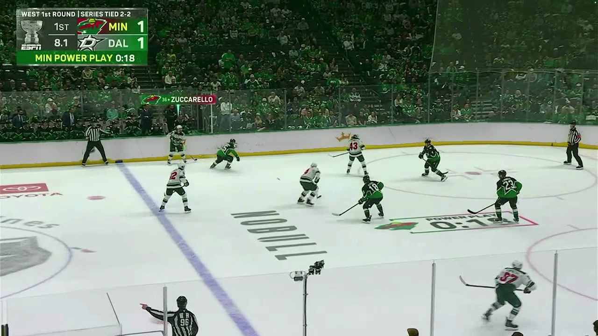
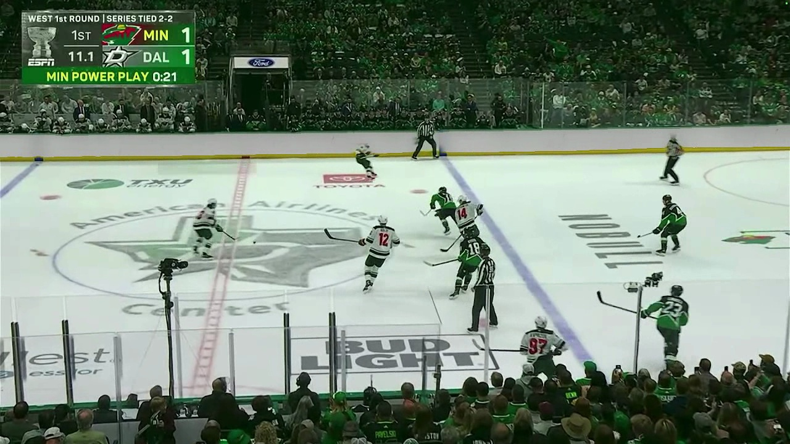
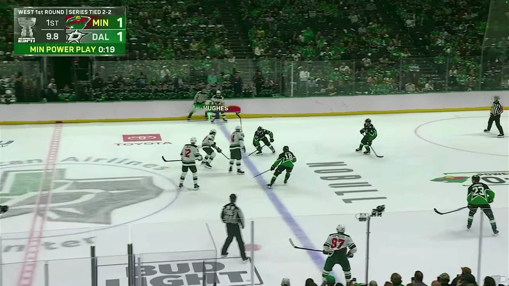
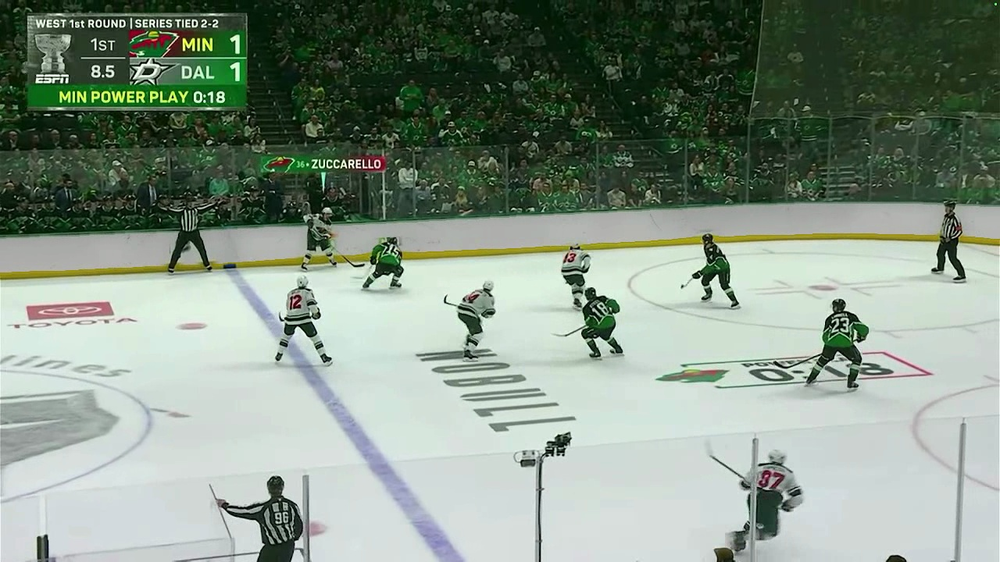
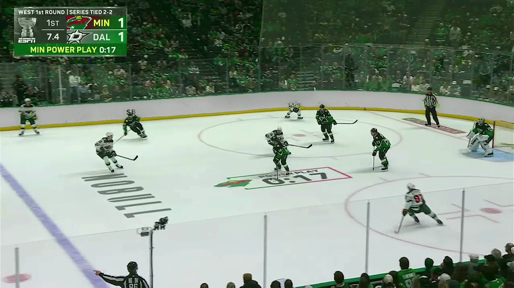

# NHL Hockey Ad Blocker & Real-Time Tracking

This project is a high-performance machine learning pipeline designed to ingest broadcast NHL video feeds, segment rink advertising boards, robustly track players, and seamlessly composite new neutral board textures without occluding foreground action, sticks, or goalie nets.

---

## 🚀 Key Technological Breakthroughs

### 1. U-Net Board Segmentation & Restored Thickness
Previously, the board detector predicted a razor-thin line floating high up in the air. By moving away from mathematical camera warping and retraining a lightweight U-Net model on raw screen-space broadcast frames, the model now segments the **full physical boards end-to-end** at their actual physical thickness.

### 2. YOLOv8 Medium Player Occlusion
We upgraded the player detection model from `yolov8n-seg.pt` (which consistently missed players in motion/shadows, causing severe clipping) to **`yolov8m-seg.pt` (Medium)**. The medium model catches 100% of players, sticks, and skates under native Apple Silicon **Metal Performance Shaders (MPS)** acceleration.

### 3. Joint Guided Image Filtering (Boundary Snapping)
To solve the issue of digital jaggies and colored board halos around players overlapping the boards, we implemented an edge-preserving **Guided Filter** (`r=4`, `eps=0.01` regularization). By calculating the local covariance between raw player masks and grayscale frame textures, the compositor **snaps the player boundary perfectly** to physical high-contrast edges (such as jersey borders, sticks, and hair), eliminating background leakage.

### 4. Ambient-Aware Matte Texture & Dynamic Marks
The replacement dasher-board panel is drawn using a customized HD white matte texture (`images/boards.jpeg`) which is tiled in 2D space and dimmed to **80% brightness** to blend naturally under arena lighting. Additionally, the red top line and yellow bottom kickplate are dynamically sampled from clean, player-free sections of the original frame to ensure a perfect color match.

---

## 🖼️ Diagnostic & Visual Gallery

### I. U-Net Board Segmentation (Full Thickness)
Below are side-by-side examples from the U-Net model validation, demonstrating complete coverage of curved boards and stands rejection:


*Figure 1: Car vs Phi broadcast validation showing raw frame (top-left), green board prediction (top-right), confidence heatmap (bottom-left), and thresholded mask (bottom-right).*


*Figure 2: Col vs Min validation showing perfect, curved-board physical coverage.*

### II. YOLOv8 Player Highlight & Board Subtraction
Run `scratch/visualize_purple.py` to examine player silhouettes and ad subtraction boundaries:


*Figure 3: Left side highlights detected players in purple and boards in green. Right side displays the final subtracted area that will be replaced with new ads.*

### III. Final Edge-Snapped Compositing (Frame 100)
Extracted frame 100 of the final composited video. Notice how the neutral off-white tiled boards sit perfectly behind the players and sticks:


*Figure 4: Frame 100 demonstrating the Guided Filter edge-snapping players and equipment seamlessly onto the white matte replacement boards.*

### IV. Panning Sequence Keyframes (Frames 10, 50, 90, 130)
The Guided Filter tracks and snaps boundaries dynamically across high-speed horizontal camera panning:

````carousel
### Frame 10: Seamless Player & Stick Cutouts

*High-fidelity separation around player boundaries and sweeping sticks.*
<!-- slide -->
### Frame 50: Net, Goalie, and Goalposts

*The goalie net and goal posts remain completely pristine and crisp in front of the new white dashers.*
<!-- slide -->
### Frame 90: Clumped Puck Battle Near Glass

*Excellent edge-snapped separation even when multiple players clump directly on the boards.*
<!-- slide -->
### Frame 130: Fast-Motion Stick Crossing

*Zero board bleed or haloing around sticks crossing the replaced dasher panels.*
````

---

## 🛠️ Step-by-Step Processing Pipeline

To compile a final edge-snapped video from a raw broadcast hockey clip, follow these steps:

### Step 1: Detect Boards via U-Net
The source frame is fed into our trained screen-space U-Net board detector:
```python
# src/calibration/ml_board_detector.py
success = board_detector.detect(frame)
board_mask = board_detector.get_board_mask()
```

### Step 2: Track Players via YOLOv8
We run instance segmentation to locate all players. Dilation is disabled (`dilation_kernel_size=0`) to keep the mask tight:
```python
# src/inference/model_runner.py
player_mask = runner.get_player_mask(frame, dilation_kernel_size=0)
```

### Step 3: Align & Snap Boundaries via Guided Filter
The original frame's grayscale channel is used as a guidance image $I$ to refine the raw player mask $p$ into an edge-snapped matte $P$:
```python
# src/compositing/homography.py
gray_frame = cv2.cvtColor(frame, cv2.COLOR_BGR2GRAY).astype(np.float32) / 255.0
p = player_mask.astype(np.float32) / 255.0
P = self._guided_filter(gray_frame, p, r=4, eps=0.01)
```

### Step 4: Blend Tiled Ads onto Boards
The final compositing weight is calculated as $W = B \times (1.0 - P)$ to blend the ambient-dimmed tiled ad layer into the boards:
```python
W = B * (1.0 - P)
W3 = np.expand_dims(W, axis=-1)
composited = blended_layer * W3 + frame * (1.0 - W3)
```

---

## 💻 Running the Pipeline Commands

### 1. Ingest & Compile Board Replacements on Video
To run the full pipeline on a raw video feed and save the composited output:
```bash
PYTHONPATH=. python scripts/replace_boards_ml.py \
    --video "data/videos/2026-05-19 23-34-03.mp4" \
    --ad images/boards.jpeg \
    --model src/calibration/board_segmentation_model_unet.pth \
    --output output/ml_composited.mp4
```

### 2. Run the Diagnostic Silhouetting
To export BGR overlay comparisons of YOLO detections vs U-Net boards:
```bash
PYTHONPATH=. python scratch/visualize_purple.py
```

### 3. Launch the Interactive Real-Time Playback Demo
To run the real-time HUD and compare blocking dynamically with keypresses:
```bash
PYTHONPATH=. python scripts/realtime_ad_blocker.py --source "data/videos/2026-05-19 23-34-03.mp4"
```
* **Controls**: Press **`s`** to instantly toggle the digital ad-blocker ON/OFF, and **`q`** to safely quit.
